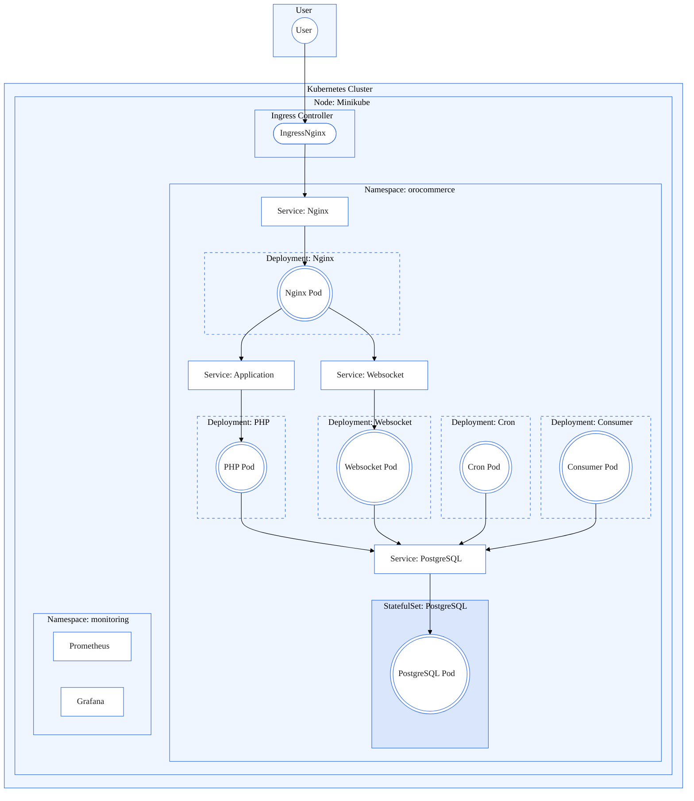

# OROCOMMERCE

Groupe:
- SCHULER Kenza
- PERDRIX Olivier
- ROME Mathis
- SOMVEILLE Quentin

## Introduction

Vous retrouverez dans ce projet, notre rendu Kubernetes. L'objectif du projet était de transformer le `docker-compose` de démonstration du CRM ORO en un Helm Chart.

L'architecture des dossiers se présente comme telle :
```text
├── dockoro
├── kuboro
│   ├── classic_version
│   └── helm_version
├── prom_grafana
│   ├── helm_version
│   └── ingress_classic_version
└── sentry
```
- Dockoro est le dossier contenant la démonstration du CRM
- Kuboro contient 2 dossiers, un premier correspondant à notre architecture avec des manifests Kubernetes, ce dossier à principalement servi à comprendre comment fonctionnait les différentes ressources Kubernetes, le second est la retranscription du premier mais en Helm Chart
- prom_grafana contient une version classique, avec l'utilisation d'un `Ingress Controller` fait maison, tandis que le second dossier utilise un fichier `values.yaml` adapté à notre besoin.
- On a essayé Sentry mais on a constaté que les services consommaient beaucoup trop de ressources par rapport à la stack Prometheus / Grafana, on a donc décidé d'abandonner cette partie.

Dans un premier temps, nous vons donnerons les prérequis au bon lancement de notre architecture.

Nous verrons ensuite un diagramme Mermaid de notre architecture.

Dans un troisième temps, nous démarerrons notre application et nos outils de monitorings

Pour finir sur un comparatif avant/après entre l'architecture de la démonstration et la notre.

## Prérequis

Démarrer votre service Docker :
```shell
sudo service docker start
```

Démarrer le cluster minikube :
```shell
minikube start
```

Minikube avec les addons suivants :
```shell
minikube addons enable ingress
minikube addons enable metrics-server
minikube addons enable volumesnapshots
minikube addons enable csi-hostpath-driver
```

Ajout du pod pour l'Ingress de classe Traefik :
```shell
helm repo add traefik https://traefik.github.io/charts
helm repo update
helm install traefik traefik/traefik
```

Démarrer le tunnel Minikube :
```shell
minikube tunnel
```

Modifier votre fichier `hosts` pour ajouter la configuration suivante :
```text
127.0.0.1   oro.demo
```

## Architecture



## Démarrer notre application

### Kubernetes classique

#### Orocommerce

Se placer dans le dossier `kuboro/classic_version`, et exécuter la commande suivante :

```shell
bash apply-project.bash
```

Une fois le job de restauration complété vous pouvez accéder à l'application via l'url [https://oro.demo](https://oro.demo).

Pour arreter l'environnement, lancer la commande suivante :
```shell
bash delete-project.bash
```

#### Monitoring

Se placer dans le dossier `prom_grafana/ingress_classic_version`, et exécuter la commande suivante :

```shell
bash apply-prom-stack-classic.bash
```

Pour arrêter l'environnement, lancer la commande suivante :
```shell
bash delete-prom-stack.bash
```

### Helm Charts

Se placer dans le dossier `kuboro/helm_version`, et exécuter la commande suivante :

```shell
helm install -n orocommerce --create-namespace orocommerce .
```

Une fois le job de restauration complété vous pouvez accéder à l'application via l'url [https://oro.demo](https://oro.demo).

Pour arreter l'environnement, lancer la commande suivante :
```shell
helm uninstall -n orocommerce orocommerce
```

#### Monitoring

Se placer dans le dossier `prom_grafana/helm_version`, et exécuter la commande suivante :

```shell
bash apply-prom-stack-helm.bash
```

Pour arrêter l'environnement, lancer la commande suivante :
```shell
bash delete-prom-stack-helm.bash
```

## Comparatif avant / après

| Aspect |  Avant  | Après |
|:-----|:--------:|------:|
| Installation  | Gestion des dépendences simples | Plus compliqué avec l'utilisation des InitContainers |
| Modularité   |  Limité : tout est contenu dans un seul fichier docker-compose.yml, peu de séparation de responsabilités  |   Fichiers découplés (templates, values.yaml, secrets, ingress...), meilleure maintenabilité |
| Déploiement cloud   | Pas adapté pour des plateformes cloud-native | Optimisé pour Kubernetes, support des déploiements dans le cloud ou en cluster on-prem |
| Mise à jour | Manuelle : nécessite de redéployer entièrement ou modifier le fichier Compose |    Support des mises à jour progressives (helm upgrade), rollback facile, versionning |
| Surveillance   | Basique, géré avec docker logs | Intégration avec Prometheus, Grafana |
| Sécurité   | Environnement local secrets en clair ou dans .env | Meilleure gestion des secrets via Kubernetes Secrets |
| Scalabilité   | Très limitée (pas de scaling horizontal automatique) | Support du scaling automatique (HPA), gestion fine des ressources CPU/mémoire |
| Usage   | Idéal pour le développement local ou les tests de démonstration | Configuration multi-environnement |
| Résilience   | Aucune | Gestion des erreurs, redémarrage automatique, probes de liveness/readiness |
